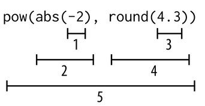

---
jupytext:
  formats: md:myst
  text_representation:
    extension: .md
    format_name: myst
kernelspec:
  display_name: Python 3
  language: python
  name: python3
---

# Functions

What is a function?
- Functions are subprograms -- they are a sequence of of statements that have a name
- Functions can be executed at any point by using their name 
- Functions remove duplicated code
- Functions can call other functions
- Functions can OPTIONALLY take argument(s) that they can use inside the function
- Functions can OPTIONALLY return value(s)

The general form of a function call is as follows:
```
<<function_name>>(<<arguments>>)
```


## Built-in functions
`abs(-9)` -- `-9` is the argument. Arguments appear between the parenthesis after the function name. Arguments are evaluated left to right.

```{code-cell} ipython3
day_temperature = 3
night_temperature = 10
abs(day_temperature - night_temperature)
```


Because function calls produce values, they can be used in expressions:
```{code-cell} ipython3
abs(-7) + abs(3.3)
```




Functions to convert one type of variable to another

```{code-cell} ipython3
int(34.6)
```

```{code-cell} ipython3
int(-4.3)
```

```{code-cell} ipython3
float(21)
```

```{code-cell} ipython3
str(21)
```

The Round function can round floats
```{code-cell} ipython3
str(21)
```

```{code-cell} ipython3
round(3.8)
```

```{code-cell} ipython3
round(3.3)
```

```{code-cell} ipython3
round(3.5)
```

```{code-cell} ipython3
round(-3.3)
```

```{code-cell} ipython3
round(-3.5)
```

The round function can take an OPTIONAL second argument

```{code-cell} ipython3
round(3.141592653,2)
```

The `help(fxn)` function gives information about a function

```{code-cell} ipython3
help(round)

```

```{code-cell} ipython3
help(pow)
```


Using the `pow` function

```{code-cell} ipython3
pow(2, 4)
```

```{code-cell} ipython3
pow(2, 4, 3)
```


We can also use function calls as arguments to other functions:
```{code-cell} ipython3
pow(abs(-2), round(4.3))
```

Some other useful functions


```{code-cell} ipython3
min(2, 3, 4)
```


```{code-cell} ipython3
max(2, -3, 4, 7, -5)```

```{code-cell} ipython3
max(2, -3, min(4, 7), -5)
```

Function objects have memory addresses just like variables:


```{code-cell} ipython3
id(-9)
```

```{code-cell} ipython3
id(23.1)
```

```{code-cell} ipython3
show_size = 8.5
id(show_size)
```

```{code-cell} ipython3
id(abs)
```

```{code-cell} ipython3
id(round)
```

## Defining your own functions
The built-in functions (e.g, type, print, input) that Python provides do basic tasks. We can write our own functions that can execute complicated sequence of instructions. 

https://www.mathsisfun.com/sets/function.html

```python
def f(x):
    squared_x  = x * x
    return squared_x
```

```python
def f(x):
    squared_x = x ** 2
    return squared_x
```

```python
def f(x):
    squared_x = pow(x, 2)
    return squared_x
```

```python
def f(x):
    return x**2
```

```python
def f(x):
    return pow(x, 2)
```


```python
def convert_to_celsius(fahrenheit):
    return (fahrenheit - 32) * 5 / 9

convert_to_celsius(80)
```

- What is a function definition?
  - A function definition is a kind of Python statement. The general form of a function definition is as follows:
  ```
    def <<function_name>>(<<parameters>>):
    <<block>>
  ```
- What is a function header? First line of function definition.
- What is a function body? What comes after the function definition and is indented by four spaces. 
- What is a return statement? ``return <<expression>>``


## Local Variables

```{code-cell} ipython3
def quadratic(a, b, c, x):
    """ax^2 + bx + c"""
    first = a * x ** 2
    second = b * x
    third = c
    return first + second + third
quadratic(2, 3, 4, 0.5)
quadratic(2, 3, 4, 1.5)
```


Variables like `first`, `second`, and `third` that are created within a function are called local variables. Local variables get created each time that function is called, and they are erased when the function returns. Because they only exist when the function is being executed, they can’t be used outside of the function. This means that trying to access a local variable from outside the function is an error, just like trying to access a variable that has never been defined is an error.

A function’s parameters are also local variables, so we get the same error if we try to use them outside of a function definition. 

The area of a program that a variable can be used in is called the variable’s **scope**. The scope of a local variable is from the line in which it is defined up until the end of the function. 

## Tracing Function Calls in the Memory Location
Let us trace the function call. https://pythontutor.com/visualize.html
```python
def f(x):
    x = 2 * x
    return x
    
x = 1
x = f(x + 1) + f(x + 2)
```


## Designing New Functions: A Recipe
- What do you name the function?
- What are the parameters, and what types of information do they refer to?
- What calculations are you doing with that information?
- What information does the function return?


Let us write three functions to practice using the recipe. 

1. Write a function that returns the number of days between `day1` and `day2`, which are​
both in the range 1-365 (thus indicating the day of the​ year).
2. Write a function that returns which day of the week it will be `days_ahead` days​ from `current_weekday`.​
`current_weekday` is the current day of the week and is in​ the range 1-7, indicating whether today is Sunday (1),​
Monday (2), ..., Saturday (7). `days_ahead` is the number of days after today.​
3. Return the day of the week it will be on birthday_day,​ given that the day of the week is current_weekday and the​
day of the year is current_day.​ current_weekday is the current day of the week and is in​
the range 1-7, indicating whether today is Sunday (1),​ Monday (2), Saturday (7).​
current_day and birthday_day are both in the range 1-365.


```python
def days_difference(day1: int, day2: int) -> int:
    """Return the number of days between day1 and day2, which are​
    both in the range 1-365 (thus indicating the day of the​ year).
    
    >>> days_difference(200, 224)
    24
    >>> days_difference(50, 50)
    0
    >>> days_difference(100, 99)
    -1
    """
    return day2 - day1
```

```python
def days_difference(day1, day2):
    """Return the number of days between day1 and day2, which are​
    both in the range 1-365 (thus indicating the day of the​ year).
    """
    return day2 - day1
```


```python
def get_weekday(current_weekday, days_ahead):
    return (current_weekday + days_ahead) % 7
```

```python
def get_birthday_weekday(current_weekday, current_day, birth_day):
    days_diff = days_difference(current_day, birth_day)
    return get_weekday(current_weekday, days_diff)
```


### Variations in functions
- No input; no output; example -- print something
- One or more input; no output; example -- print the input
- One or more input: one or more output; example -- take two numbers and return their sum
- No input; one or more output; example -- a random number


## Omitting a return Statement: None

If you do not have a `return` statement in a function, nothing is produced. By default the `None` data type is returned. 

```{code-cell} ipython3
def f(x):
    x = x * 2

res = f(3)
res
```

```python
print(res)
id(res)
```

```{code-cell} ipython3
def f(x):
    x = x * 2
    return None

print(f(3))
```

## Summary
- A function definition introduces a new variable that refers to a function object. The return statement describes the value that will be produced as a result of the function when this function is done being executed.
- A parameter is a variable that appears between the parentheses of a function header.
- A local variable is a variable that is used in a function definition to store an intermediate result in order to make code easier to write and read.
- A function call tells Python to execute a function.
- An argument is an expression that appears between the parentheses of a function call. The value that is produced when Python evaluates the expression is assigned to the corresponding parameter.
- If you made assumptions about the values of parameters or you know that your function won’t work with particular values, write a precondition to warn other programmers. 